## 主流远程桌面软件分析报告

### 市场概况

2025 年全球远程桌面软件市场规模约 39.2 亿美元，预计以 14%+ 的年复合增长率持续扩张。RDP 协议仍是使用最广泛的底层协议，占据约 60% 市场份额；VNC 居其次；WebRTC 方案近年快速增长。市场整体分为三大阵营：全球企业级（TeamViewer、AnyDesk 等）、国内大众市场（向日葵、ToDesk 等）以及开源自建派（RustDesk）。

---

### 一、全球主流软件

#### 1. TeamViewer

**远程会话管理界面：**
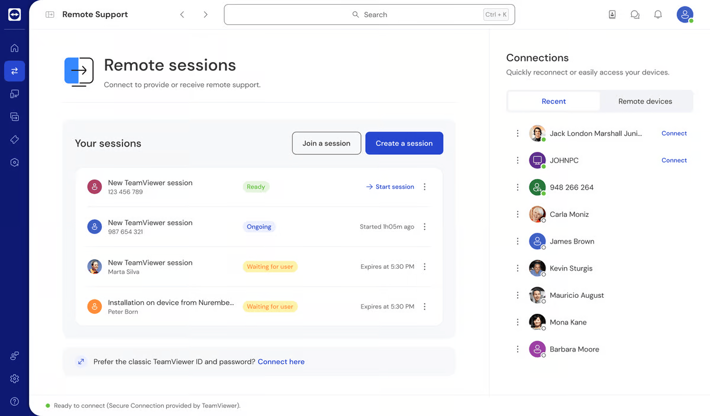

**远程控制设置面板：**
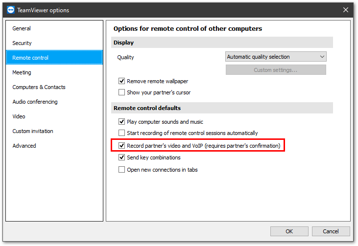

| 维度 | 详情 |
|------|------|
| **流行度** | 全球市占率约 54%（远程支持安装量，6sense 2025），覆盖 200+ 国家，超 6 亿设备安装量 |
| **技术架构** | 混合架构——同时结合帧缓冲捕获与远程绘制调用；自研专有协议，支持 AES-256 端到端加密；连接中继（relay）+ P2P 混合穿透 |
| **编解码** | 自研图像压缩，H.264 视频编码，自适应画质调节 |
| **适用场景** | 企业 IT 远程支持、MSP 服务商、跨平台（Win/Mac/Linux/iOS/Android）远程协作、AR 远程协助 |
| **定价** | 个人免费；商业版 $49/月起，Tensor 企业版定制报价 |
| **优势/劣势** | 功能最全、生态最成熟，但价格较高，商业使用检测严格（免费版频繁弹出商用提示） |

#### 2. AnyDesk

**设置面板（General 选项）：**
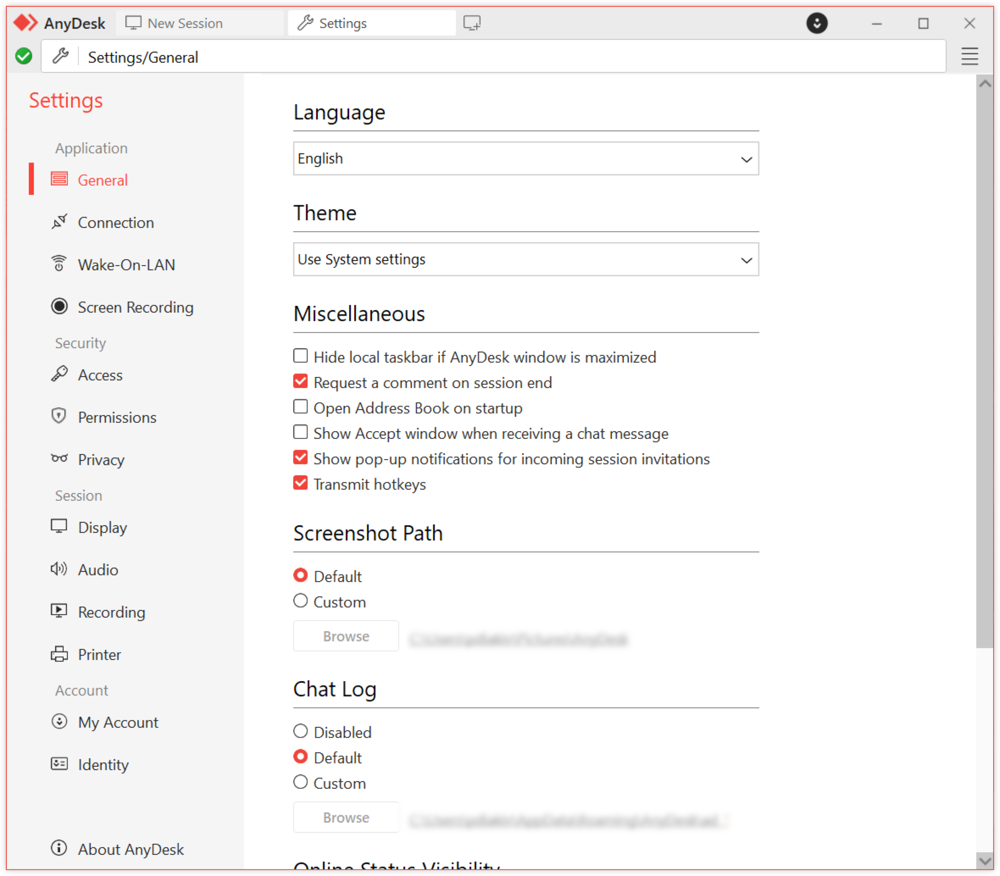

| 维度 | 详情 |
|------|------|
| **流行度** | 全球第二大远程桌面软件，超 5 亿下载量，在欧洲市场表现尤其突出 |
| **技术架构** | 自研 DeskRT 协议，核心思路是"帧缓冲 + 指令拦截"双模式混合：对图形变化区域采用视频编码，对 UI 元素（文字、窗口移动）采用指令重绘，大幅降低带宽占用 |
| **编解码** | DeskRT 专有编解码器，专为桌面内容优化（与通用视频编码不同），支持硬件加速 |
| **适用场景** | 中小企业远程办公、IT 技术支持、跨平台远程访问 |
| **定价** | 个人免费；商业版 $10.30/月起 |
| **优势/劣势** | 轻量、连接速度快、带宽效率高；2024 年曾遭遇安全事件（社会工程攻击），安全信誉受损 |

#### 3. Splashtop

**Streamer 状态面板：**
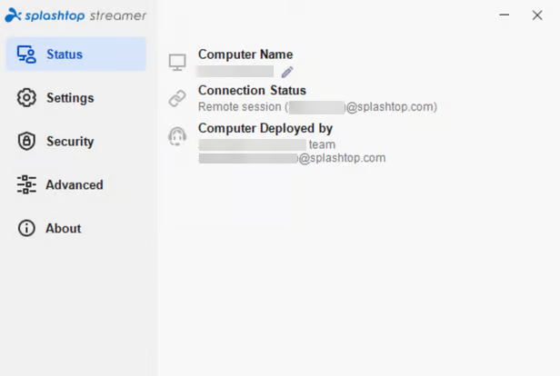

| 维度 | 详情 |
|------|------|
| **流行度** | 北美市场第三梯队领先者，超 3000 万用户，MSP 群体使用率较高 |
| **技术架构** | 专有协议，P2P 优先 + 中继兜底，支持 GPU 硬件加速编码 |
| **编解码** | H.264 硬件编码，高帧率流式传输 |
| **适用场景** | 中小企业/初创团队（性价比高）、MSP 远程管理、远程教育与医疗 |
| **定价** | 商业版 $6/月起，市场中最具性价比的商业方案之一 |

#### 4. ConnectWise ScreenConnect

**全局设置 - 自定义字段管理：**
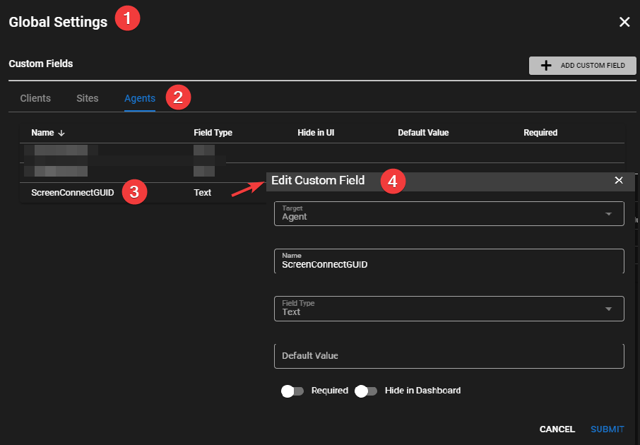

| 维度 | 详情 |
|------|------|
| **流行度** | MSP（IT 托管服务商）领域标杆产品 |
| **技术架构** | 专有协议，支持无人值守访问，内置设备发现和批量管理 |
| **适用场景** | MSP 远程运维、IT 服务商管理大量终端设备 |
| **定价** | $30/并发技术员，适合按技术员计费的 MSP 模式 |

---

### 二、国内主流软件

#### 5. 向日葵（Sunlogin）

**远程协助主界面（识别码 + 验证码连接）：**
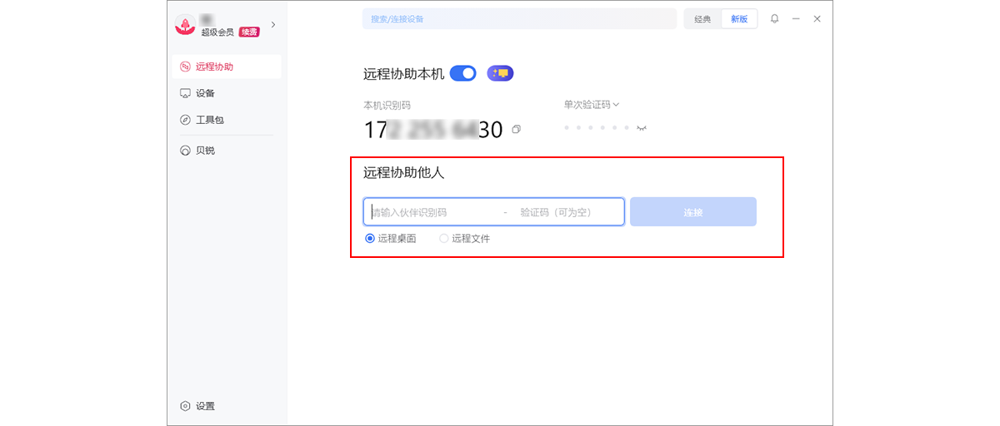

**远控会话内设置面板（屏幕比例/性能模式）：**
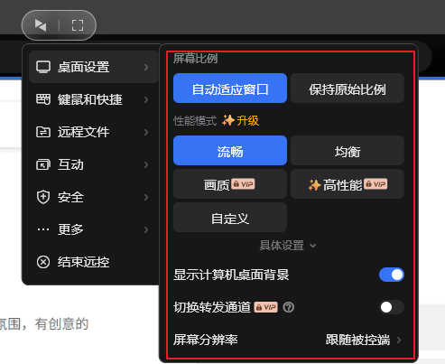

**企业版控制端 — 生成设备 + 葵码登录：**
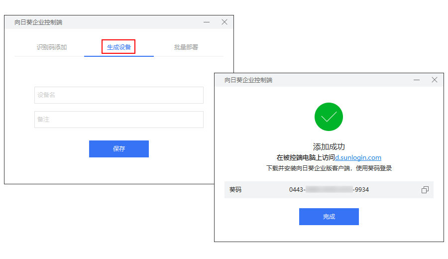

| 维度 | 详情 |
|------|------|
| **流行度** | 国内知名度最高的远程控制软件之一，用户基数过亿，品牌认知度极强 |
| **技术架构** | 自研协议，支持 P2P 穿透（UDP 打洞）+ 中继服务器转发双通道；免费版带宽有限制 |
| **编解码** | H.264，硬件加速支持 |
| **适用场景** | 个人远程办公、家庭远程协助、轻量级企业使用 |
| **定价** | 基础功能免费；专业版按带宽/功能分级付费 |
| **优势/劣势** | 品牌知名度高、上手简单；但免费版带宽限制明显，多屏管理、远程摄像头等高级功能需付费，企业审计能力较弱 |

#### 6. ToDesk

**主连接界面（设备码 + 密码 + 连接模式）：**
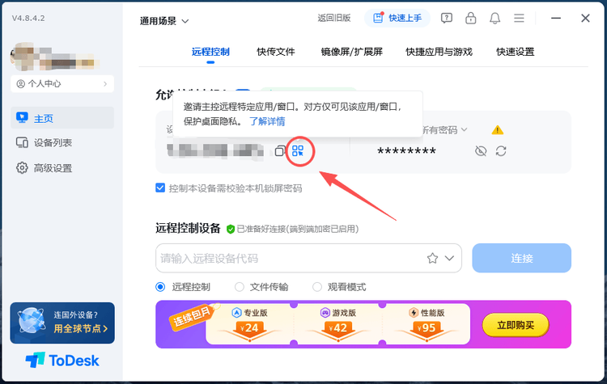

**远控会话工具栏（画质/帧率/HDR 设置）：**
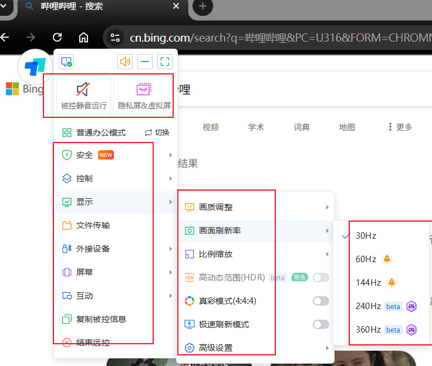

**设备列表管理（在线/离线状态 + 快捷操作）：**
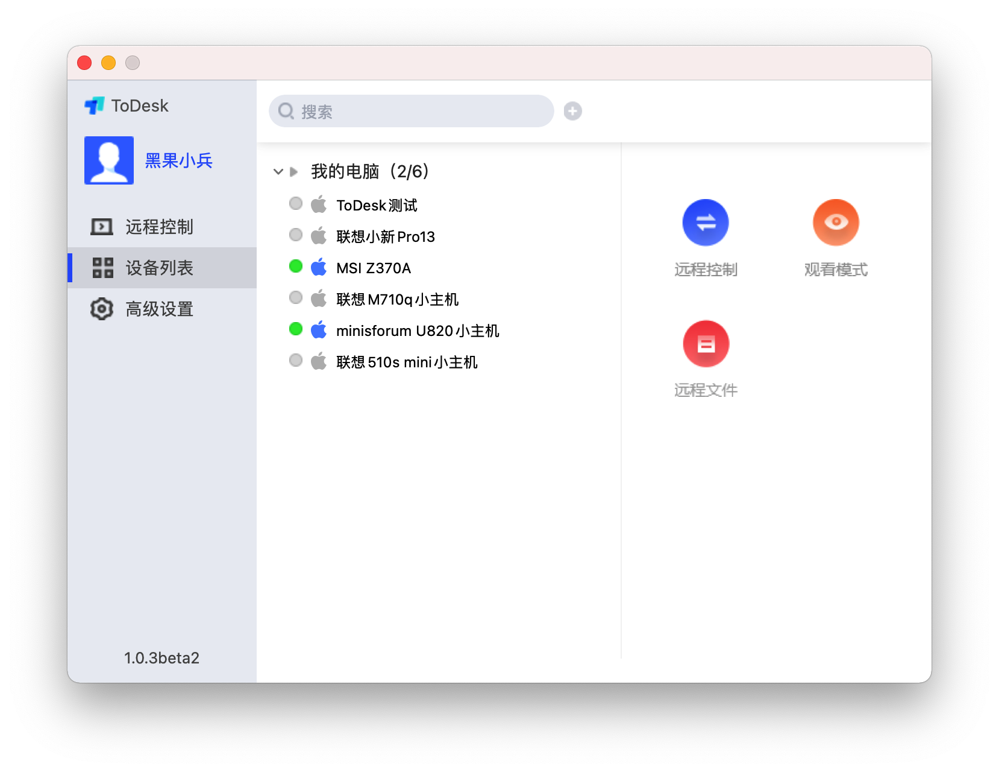

**隐私屏 & 虚拟屏幕设置：**
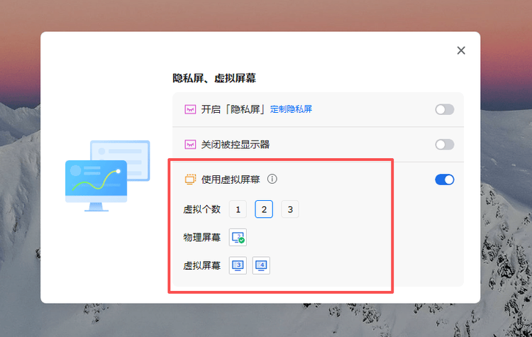

| 维度 | 详情 |
|------|------|
| **流行度** | 国内用户量超 2 亿，近年增长最快的远控软件之一 |
| **技术架构** | 自研 ZeroSync® 传输引擎，官方宣称端到端延迟低至 3ms，支持 P2P + 中继双通道 |
| **编解码** | 支持最高 8K 分辨率、360fps 帧率传输，H.265 硬件编码 |
| **适用场景** | 个人远程办公、游戏远程串流、企业远程协作 |
| **定价** | 个人基础版免费，专业版/企业版分层付费 |
| **优势/劣势** | 连接速度快、界面现代；企业级审计和安全功能仍在完善中 |

---

### 三、开源/自建方案

#### 7. RustDesk

**连接界面（Your Desktop + Control Remote Desktop）：**
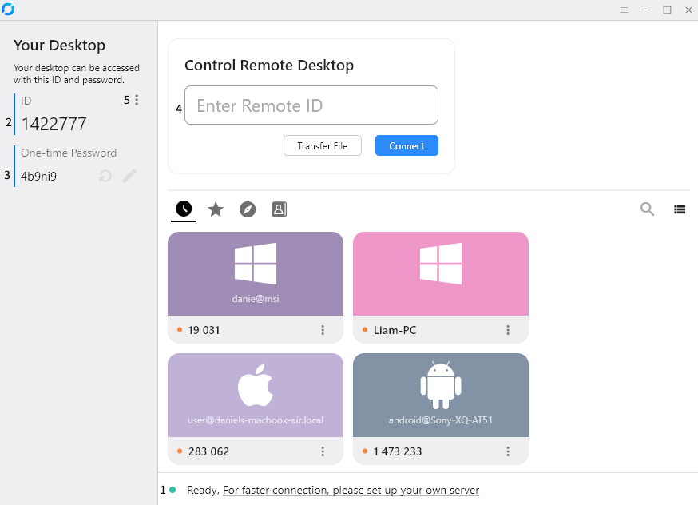

**Server Pro 管理控制台（设备/日志/用户/策略）：**
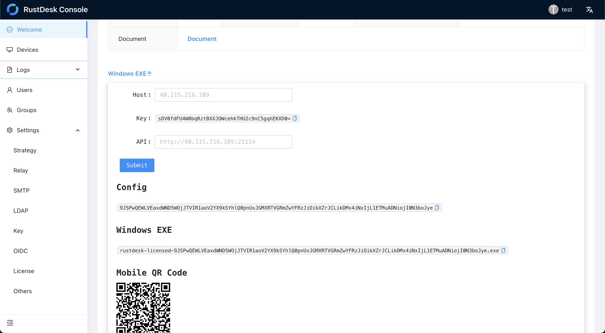

| 维度 | 详情 |
|------|------|
| **流行度** | GitHub 90k+ Stars，开源远程桌面领域最活跃的项目，全球开发者社区高度关注 |
| **技术架构** | 客户端-服务器分离架构。客户端通过 Rendezvous Server（会合服务器）交换信令，成功后 P2P 直连（UDP 打洞）；失败则通过 Relay Server 中继转发。服务端使用 Rust 编写，轻量高效 |
| **编解码** | 软件编解码支持 VP8/VP9/AV1；硬件编解码支持 H.264/H.265 |
| **适用场景** | 重视数据隐私的个人/团队、需要自建服务器完全掌控数据的企业、技术团队内部使用 |
| **定价** | 开源免费（Apache 2.0）；提供 Pro 版增加 Web 管理台等企业功能 |
| **优势/劣势** | 完全开源、可自建服务器、无商用限制；但需要自行部署和维护服务器，对非技术用户门槛较高 |

#### 8. Chrome Remote Desktop

**Remote Support 界面（共享屏幕 + 连接远程设备）：**
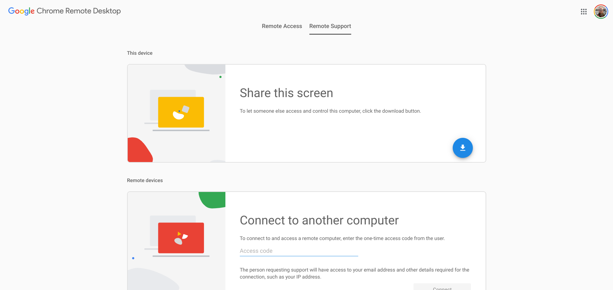

**深色模式界面：**
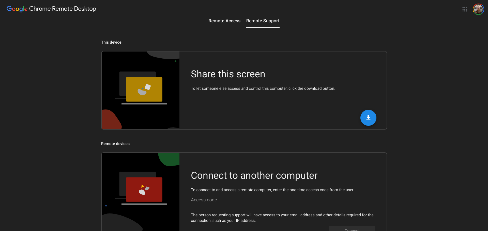

| 维度 | 详情 |
|------|------|
| **流行度** | 依托 Chrome 浏览器生态，轻量使用场景下用户量可观 |
| **技术架构** | 本质上是 VNC 变种，通过 Google 基础设施中继传输；基于 WebRTC 的信令通道 |
| **适用场景** | 临时远程协助、个人设备间远程访问、无客户端安装需求的场景 |
| **定价** | 完全免费 |
| **优势/劣势** | 零成本、无需安装独立客户端；功能极简，不适合专业 IT 管理场景 |

#### 9. Windows RDP（远程桌面协议）

**Windows App 引导界面（Step 1/3）：**
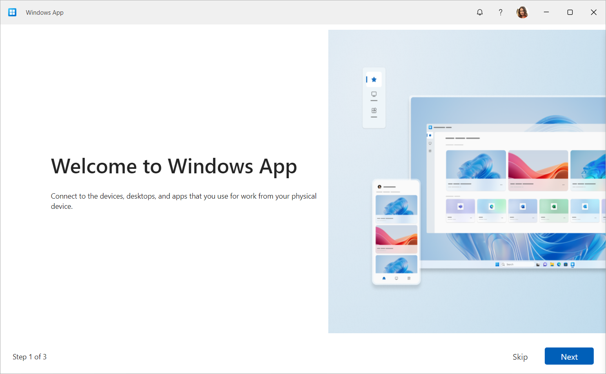

**经典 mstsc.exe 连接对话框：**
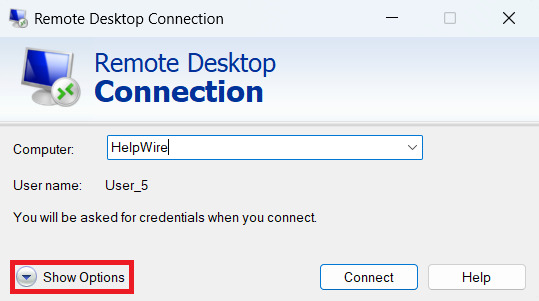

**Windows App 设备管理（iPad 端）：**
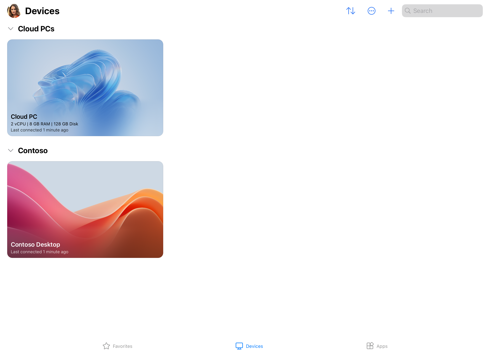

| 维度 | 详情 |
|------|------|
| **流行度** | 全球使用最广泛的底层远程桌面协议，所有 Windows 系统内置 |
| **技术架构** | 微软专有协议，基于"绘制指令传输"而非纯帧缓冲捕获——服务端将 GDI/DirectX 绘制指令发送到客户端重绘，带宽效率极高。支持 Network Level Authentication (NLA)、TLS 加密 |
| **编解码** | 指令重绘为主，位图压缩为辅（RemoteFX 引入 H.264 视频编码处理多媒体场景） |
| **适用场景** | Windows 企业内部管理、服务器远程运维、VDI（虚拟桌面基础架构） |
| **定价** | Windows 内置免费（但需要 Pro/Enterprise 版本；Server 版需要 RDS CAL 许可证） |
| **优势/劣势** | 性能优异、深度集成 Windows；但仅限 Windows 生态，跨平台能力弱，直接暴露 RDP 端口存在严重安全风险 |

---

### 四、核心技术架构对比

| 软件 | 连接模式 | 底层协议 | 编解码 | 加密 |
|------|---------|---------|--------|------|
| TeamViewer | P2P + Relay 混合 | 自研专有 | H.264 + 自研压缩 | AES-256 |
| AnyDesk | P2P + Relay 混合 | DeskRT | DeskRT 专有 | TLS 1.2 + AES-256 |
| Splashtop | P2P 优先 + Relay | 自研专有 | H.264 硬件编码 | TLS + AES-256 |
| 向日葵 | P2P + Relay | 自研专有 | H.264 | AES |
| ToDesk | P2P + Relay | ZeroSync® | H.265 硬件编码 | AES-256 |
| RustDesk | P2P + Relay（可自建）| 自研（Rust）| VP8/VP9/AV1/H.264/H.265 | NaCl + AES |
| Chrome RD | Google 中继 | VNC 变种 + WebRTC | VP8/WebRTC | TLS |
| Windows RDP | 直连（或经网关）| RDP 协议 | 指令重绘 + RemoteFX H.264 | TLS + NLA |

---

### 五、场景选型建议

**个人/家庭远程协助**：向日葵、ToDesk（国内速度快、免费够用）、Chrome Remote Desktop（临时使用）

**中小企业远程办公**：ToDesk、Splashtop（性价比高）、AnyDesk（轻量快速）

**MSP/IT 服务商**：ConnectWise ScreenConnect（设备批量管理）、TeamViewer（功能最全面）

**大型企业/跨国公司**：TeamViewer Tensor、自建 RustDesk + 企业管控层

**隐私敏感/技术团队自建**：RustDesk（完全开源、自主可控）、Windows RDP（内网直连）

**游戏远程串流/高性能场景**：ToDesk（高帧率支持）、Parsec（专注游戏，未列入主表）

---

### 六、关键趋势

远程桌面领域正在经历几个明显的技术演进方向。首先是 AI 辅助运维的融入，主流厂商（TeamViewer、ConnectWise）都在集成 AI 进行异常检测和自动化修复。其次是 Zero Trust 安全架构的引入，传统 RDP 直接暴露端口的模式正在被零信任网关替代。第三是编解码器向 AV1 迁移，AV1 在相同画质下可比 H.264 节省约 30-50% 带宽，RustDesk 已经支持 AV1 软件解码。最后是 WebRTC 方案的崛起，浏览器原生远程访问免去了安装客户端的需求，代表了轻量化方向。

---

### 七、功能特点与 UI 交互逻辑深度分析

#### 1. TeamViewer — 管理控制台范式

TeamViewer 采用左侧导航 + 右侧内容区的经典分栏布局，整体交互模型基于"管理控制台"范式。

**核心功能亮点：**

设备连接管理面板以列表形式展示近期连接的设备，每个设备条目附带彩色状态指示器（绿色圆点 = 在线），用户可快速识别设备可用性并一键发起连接。"Connect with ID"区域提供 TeamViewer ID 和密码的展示，配备复制按钮和密码可见性切换控件（眼睛图标），支持将本机连接信息快速分享给远端协助者。

底部"Device Status"面板实时展示 CPU（90%）、RAM（76%）、系统运行时间、电池电量、磁盘健康状态、防火墙状态等关键系统指标，采用进度条与数值双重编码，信息密度高且可读性强。这一功能在远程桌面工具中属于差异化能力。

集成的 AI 助手"Copter"具备屏幕内容智能分析能力（截图中显示"Analyzing screenshot..."状态），代表了远程桌面工具向智能化方向演进的趋势。

**UI 交互特点：** 三层信息架构——左侧 Connections 面板作为主导航（L1），右侧内容区动态切换（L2），底部 Device Status 作为常驻信息条（L0）。设计语言以浅色背景为基底，品牌蓝为主色调，大圆角卡片（12-16px）包裹各功能区块。不足之处在于单屏信息密度过高，对初级用户可能造成认知过载。

---

#### 2. AnyDesk — 仪表板启动台范式

AnyDesk 采用深色主题的仪表板式布局，交互模型更接近"启动台（Launchpad）"而非传统管理控制台。

**核心功能亮点：**

四张水平排列的彩色功能卡片（橙色"Anytime Access"、粉色、灰色、蓝色）将核心功能模块化呈现，高饱和度色彩在深色背景上形成强烈的视觉对比。标题栏区域展示实时系统性能指标（"1325.46 / 352.980"），可能为网络吞吐量或会话编码参数，为高级用户提供底层性能可见性。

基于 DeskRT 编解码器优化，在低带宽环境下仍可维持流畅的远程画面传输。支持设置固定密码实现无人值守远程访问。

**UI 交互特点：** 采用 Hub-and-Spoke（中心辐射）交互模型——仪表板作为中心节点，各功能卡片作为辐射节点。所有核心功能两步可达（首页 → 功能页），操作效率高。深色主题符合 IT 运维人员的实际使用环境（暗光场景）。不足之处在于标题栏数字指标缺乏标签说明，违反"可识别而非回忆"的可用性原则；功能卡片仅四张，后续扩展面临水平空间不足的问题。

---

#### 3. Splashtop — 场景化引导范式

Splashtop 的 UI 策略以场景化引导为核心，强调易用性和亲和力。

**核心功能亮点：**

支持最高 4K 分辨率、60fps 的远程桌面流传输，适用于设计、视频编辑等专业场景。支持多显示器同时查看和控制、远程唤醒（Wake-on-LAN）、拖拽文件传输及远程打印。会话录制功能满足企业合规和安全审计需求。

**UI 交互特点：** 营销界面大量使用真实场景摄影（如咖啡厅协作场景），构建"产品融入日常生活"的心理模型，降低技术产品的距离感。温暖自然的色调与远程桌面工具通常的"冷科技感"形成差异化。不足之处在于场景化叙事可能导致技术型用户无法快速获取关注的技术规格，且对需要管理数百台设备的企业级用户可能传达"不够专业"的信号。

---

#### 4. ConnectWise ScreenConnect — 企业数据管理范式

ScreenConnect 的交互逻辑以任务导向和规模化管理为核心设计原则。

**核心功能亮点：**

专为 MSP 设计，支持多租户架构和大规模设备远程管理。与 ConnectWise 生态系统（Manage、Automate 等）深度集成，实现从工单到远程会话的无缝流转。支持多会话并发管理、后台文件传输、远程命令终端。完整的会话录制功能满足 SOC 2、HIPAA 等合规要求。支持白标定制（White-labeling），MSP 可以自有品牌定制客户端界面。

**UI 交互特点：** 三层架构——顶部全局导航（L0）→ 左侧筛选/分组面板（L1）→ 右侧数据表格（L2），是管理大规模设备的最佳实践。右键上下文菜单和键盘快捷键丰富，高级用户操作效率极高。品牌色为独特的青绿色（Teal），辨识度较高。不足之处在于界面的"企业感"对新用户过于沉重，学习曲线陡峭，视觉设计相对保守。

---

#### 5. 向日葵（Sunlogin） — 品牌驱动型设计

向日葵以抽象视觉艺术建立品牌认知，强调技术实力与速度优势。

**核心功能亮点：**

支持跨平台远程桌面连接与控制。自研远程桌面协议强调低延迟、高帧率传输。提供主机批量管理、设备分组、远程文件传输、远程开机（WOL）等企业级功能。支持远程摄像头调用和远程 CMD/SSH 终端命令。面向企业客户提供私有化部署方案。提供免安装绿色版降低临时使用门槛。

**UI 交互特点：** 首页以大面积抽象光效（紫蓝渐变光束）作为 Hero 区域，将"速度"与"科技感"通过视觉语言直接传达。连接流程极度扁平化——"输入设备识别码 + 验证码"两步连接。远程控制建立后切换为全屏控制模式，顶部悬浮工具栏提供画质切换、文件传输等功能入口。不足之处在于抽象视觉表达可能降低功能信息传达效率，深色 + 光效风格与企业 IT 决策者偏好的"稳重可信赖"调性存在偏差。

---

#### 6. ToDesk — 功能驱动型设计

ToDesk 以清晰的产品界面展示降低用户决策成本，强调易用性和安全性。

**核心功能亮点：**

"允许控制本设备"的显式 Toggle 开关体现了对用户隐私权的尊重，符合全球隐私保护设计趋势。独创性地将日历功能与远程设备管理结合，允许用户按时间线回溯历史连接记录。设备历史通过"最近""收藏""下载"三个维度组织，满足不同使用频率下的快速检索。绿色验证徽章标识设备认证状态，借用社交平台已建立的用户心智模型。自研 ZeroSync® 传输引擎支持最高 8K 分辨率、360fps 帧率传输。

**UI 交互特点：** 移动端采用抽屉式侧边菜单（Hamburger Menu），菜单项采用"图标 + 文字标签"组合，层级扁平。以白色/浅灰为基底色，蓝色作为主强调色，绿色用于验证状态。大量使用圆角矩形（8-16px），营造亲和、现代的视觉感受。不足之处在于侧边栏将"最近""收藏"等高频功能隐藏在二级入口，建议考虑底部 Tab Bar 提升可达性；设备列表缺乏搜索和筛选功能展示。

---

#### 7. RustDesk — 功能密度与自主可控

RustDesk 的深色主题界面面向技术用户，追求功能密度与灵活性。

**核心功能亮点：**

支持公共中继服务器与私有服务器双模式，ID 格式 `374296273@public` 清晰区分服务器归属。设备分组与多维标签管理（如 AMK、CityHall、Home、Linux、Mac、Windows）极为灵活，同一台设备可同时属于多个分类维度。一次性密码（OTP）动态凭证机制增强连接安全性。文件传输与远程连接并列为一级操作入口，精准匹配远程运维两大核心场景。彩色设备磁贴在大体量设备列表中提供出色的视觉锚点。

**UI 交互特点：** 左右分栏布局——左侧"本机信息面板"（身份标识、密码、状态），右侧主操作区（连接输入 + 设备列表）。核心操作路径极短：输入 ID → 点击连接，两步即达。顶部工具栏提供搜索、网格视图、全屏、设置、布局切换。不足之处在于侧栏编辑/锁定/添加图标缺少文字标注，可发现性不足；工具栏图标密度较高且缺乏视觉分组。

---

#### 8. Chrome Remote Desktop — 极致简洁与零摩擦

Chrome Remote Desktop 代表了"简单优先"的设计哲学，追求零安装、零配置。

**核心功能亮点：**

完全基于 Web 技术栈，通过 remotedesktop.google.com 即可访问，无需下载独立客户端。直接复用 Google 账号进行身份认证和设备绑定。远程访问和远程协助两种模式清晰分离，精准匹配两种不同使用意图。支持设置 PIN 码实现无人值守连接。自动画质与带宽适配，根据网络状况动态调整。

**UI 交互特点：** 遵循 Material Design 规范，页面垂直流式排列，信息密度极低，大量留白。极度扁平化导航——打开网页 → 选择模式 → 输入 PIN → 连接，全程无需侧边栏或多级下拉。不足之处在于功能极度精简导致专业能力缺失，没有设备分组、批量管理、文件传输管理器等高级功能；设备列表为纯平面结构，超过 10 台时缺乏搜索筛选能力。

---

#### 9. Windows RDP（Windows App）— 企业级能力与生态整合

Windows App 采用 Fluent Design 设计语言，追求与 Windows 操作系统的无缝融合。

**核心功能亮点：**

基于 RDP 协议提供 Windows 远程主机的原生高质量连接，支持 RemoteFX 图形加速、多显示器配置、音频重定向。首次启动采用 3 步引导向导（Step 1/3），逐步引导用户了解核心功能。左侧垂直工具栏提供 4 种视图模式（收藏、网格、列表、更多），宽度仅 48px，最大化内容展示区域。深度集成 Azure AD、Intune、Conditional Access 等企业安全策略。红色通知徽章集成在用户头像上，避免打断当前任务流。

**UI 交互特点：** 浅蓝灰色主背景 + 微软蓝操作色 + Fluent Design 图标体系，与 Windows 11 视觉高度一致。向导采用"渐进式披露"策略，每步只传递一个核心概念，"Skip" 按钮尊重老用户。不足之处在于工具栏 4 个图标均无文字标注，触屏设备上浮交互不友好；向导进度指示不够醒目；与非 Windows 平台的互操作性仍有提升空间。

---

#### 功能与 UI 横向对比

| 产品 | UI 范式 | 主题 | 信息密度 | 导航深度 | 核心 UI 差异 | 学习曲线 |
|------|---------|------|---------|---------|-------------|---------|
| TeamViewer | 管理控制台 | 浅色 | 中高 | 2-3 层 | AI 助手 + 设备监控仪表盘 | 中等 |
| AnyDesk | 仪表板启动台 | 深色 | 低（首页） | 1-2 层 | 色彩编码功能卡片 | 低 |
| Splashtop | 场景化引导 | 温暖自然 | 低 | 1-2 层 | 真实场景摄影驱动 | 低 |
| ScreenConnect | 企业数据管理 | 浅色 | 高 | 3-4 层 | 三层架构 + 右键上下文菜单 | 高 |
| 向日葵 | 品牌驱动型 | 深色+光效 | 中 | 2 层 | 抽象光效品牌视觉 | 低 |
| ToDesk | 功能驱动型 | 浅色 | 中 | 2 层 | 权限透明化 + 日历回溯 | 低 |
| RustDesk | 控制面板 | 深色 | 中高 | 1-2 层 | 多维标签 + 彩色设备磁贴 | 中等 |
| Chrome RD | 极简向导 | 浅色 | 极低 | 1 层 | 零安装单任务流 | 极低 |
| Windows RDP | 渐进式引导 | 浅色 | 中 | 2-3 层 | Fluent Design + 3步向导 | 低-中 |

---

### 八、功能逐项对比分析

#### 1. 连接与访问能力

| 功能项 | TeamViewer | AnyDesk | Splashtop | ScreenConnect | 向日葵 | ToDesk | RustDesk | Chrome RD | Windows RDP |
|--------|-----------|---------|-----------|--------------|--------|--------|----------|-----------|-------------|
| ID/密码连接 | ✅ | ✅ | ✅ | ✅ | ✅ | ✅ | ✅ | ❌ | ✅ |
| 无人值守访问 | ✅ | ✅ | ✅ | ✅ | ✅ | ✅ | ✅ | ✅ PIN | ✅ |
| 邮件/链接邀请 | ✅ | ✅ | ✅ SOS码 | ✅ 连接码 | ✅ 协助请求 | ✅ 协助请求 | ❌ | ❌ | ❌ |
| 扫码连接 | ❌ | ❌ | ❌ | ❌ | ✅ | ✅ | ❌ | ❌ | ❌ |
| 浏览器端连接 | ✅ | ❌ | ✅ | ✅ | ❌ | ❌ | ✅ Pro版 | ✅ 原生 | ❌ |
| 局域网直连 | ✅ | ✅ | ❌ | ❌ | ✅ P2P | ✅ P2P | ✅ | ❌ | ✅ |
| 多显示器支持 | ✅ | ✅ | ✅ | ✅ 付费 | ✅ | ✅ | ✅ | ❌ | ✅ 最多16屏 |
| 并发会话 | 1-3(按许可) | 1-2(按许可) | 按许可 | 1-10(按计划) | 1(免费)多(付费) | 1(免费)多(付费) | 无限制 | 1 | 按CAL |
| Windows | ✅ | ✅ | ✅ | ✅ | ✅ | ✅ | ✅ | ✅ | ✅ |
| macOS | ✅ | ✅ | ✅ | ✅ | ✅ | ✅ | ✅ | ✅ | ✅ |
| Linux | ✅ | ✅ | ✅ | ✅ | ✅ | ✅ | ✅ | ✅ | ✅ |
| iOS/Android | ✅ | ✅ | ✅ | ✅ | ✅ | ✅ | ✅ | ✅ 仅控制端 | ✅ |
| 鸿蒙/UOS/麒麟 | ❌ | ❌ | ❌ | ❌ | ❌ | ✅ | ❌ | ❌ | ❌ |
| FreeBSD/RPi | ❌ | ✅ | ❌ | ❌ | ❌ | ❌ | ✅ | ❌ | ❌ |

#### 2. 文件与数据传输

| 功能项 | TeamViewer | AnyDesk | Splashtop | ScreenConnect | 向日葵 | ToDesk | RustDesk | Chrome RD | Windows RDP |
|--------|-----------|---------|-----------|--------------|--------|--------|----------|-----------|-------------|
| 拖放传输 | ✅ | ✅ | ✅ | ✅ | ✅ | ✅ | ✅ | ❌ | ❌ |
| 剪贴板同步 | ✅ | ✅ | ✅ | ✅ | ✅ | ✅ | ✅ | ❌ | ✅ |
| 文件管理器 | ✅ | ✅ | ✅ | ✅ | ✅ | ✅ | ✅ | ❌ | ❌ |
| 断点续传 | ✅ | ❌ | ❌ | ❌ | ✅ | ✅ 10GB级 | ❌ | ❌ | ❌ |
| 传输加密 | RSA+AES | TLS+RSA | AES-256 | AES-256 | AES-256 | RSA+AES | NaCl | DTLS | TLS |

#### 3. 协作功能

| 功能项 | TeamViewer | AnyDesk | Splashtop | ScreenConnect | 向日葵 | ToDesk | RustDesk | Chrome RD | Windows RDP |
|--------|-----------|---------|-----------|--------------|--------|--------|----------|-----------|-------------|
| 远程打印 | ✅ | ✅ | ✅ 付费 | ✅ 付费 | ✅ | ✅ | ❌ | ❌ | ✅ |
| 文字聊天 | ✅ | ✅ | ✅ | ✅ | ✅ | ✅ | ❌ | ❌ | ❌ |
| 白板/标注 | ✅ | ✅ | ✅ | ❌ | ✅ | ✅ | ❌ | ❌ | ❌ |
| 会话录制 | ✅ | ✅ | ✅ WebM/MP4 | ✅ 付费 | ✅ MP4 | ✅ 企业版 | ❌ | ❌ | ❌ |
| 远程摄像头 | ❌ | ❌ | ❌ | ✅ 高级 | ✅ | ✅ | ❌ | ❌ | ❌ |
| VoIP语音 | ❌ | ❌ | ❌ | ✅ 付费 | ✅ | ❌ | ❌ | ❌ | ❌ |
| 屏幕墙 | ❌ | ❌ | ❌ | ❌ | ✅ 企业版 | ❌ | ❌ | ❌ | ❌ |
| 多人协作 | ✅ 会议 | ✅ | ❌ | ❌ | ❌ | ✅ 多光标 | ❌ | ❌ | ❌ |

#### 4. 安全与权限

| 功能项 | TeamViewer | AnyDesk | Splashtop | ScreenConnect | 向日葵 | ToDesk | RustDesk | Chrome RD | Windows RDP |
|--------|-----------|---------|-----------|--------------|--------|--------|----------|-----------|-------------|
| 加密标准 | RSA-2048+AES-256 | TLS+RSA-2048+AES-256 | TLS+AES-256 | AES-256 | RSA-2048+AES-256 | RSA+AES-256/SM4 | NaCl(XSalsa20) | DTLS/SRTP | TLS+AES-256 |
| 双因素认证 | ✅ | ✅ | ✅ | ✅ | ✅ | ✅ | ❌ | Google账号 | ✅ MFA |
| SSO单点登录 | ❌ | ❌ | ✅ SAML | ✅ | ❌ | ❌ | ❌ | Google SSO | ✅ Entra ID |
| 隐私屏/黑屏 | ✅ | ❌ | ✅ 锁屏 | ❌ | ✅ | ✅ 可自定义 | ❌ | ❌ | ❌ |
| 屏幕水印 | ❌ | ❌ | ❌ | ❌ | ✅ | ✅ 明暗水印 | ❌ | ❌ | ❌ |
| 访问控制(RBAC) | ✅ 高级版 | ✅ | ❌ | ✅ | ✅ 权限分级 | ✅ 企业版 | ❌ | ❌ | ✅ |
| 审计日志 | ✅ | ✅ | ✅ | ✅ | ✅ 企业版 | ✅ 企业版 | ❌ | ❌ | ✅ |
| IP黑白名单 | ✅ | ✅ 白名单 | ❌ | ❌ | ✅ | ✅ | ❌ | ❌ | ✅ |
| 暴力破解防护 | ✅ | ✅ | ❌ | ✅ | ✅ | ✅ | ❌ | ❌ | ✅ NLA |
| 合规认证 | ISO27001/SOC2/3 | 银行级 | HIPAA/FERPA/ISO27001/SOC2 | SOC2/FIPS/PCI/HIPAA | 等保三级 | ISO27001 | 开源审计 | Google合规 | Microsoft合规 |
| 防诈机制 | ❌ | ❌ | ❌ | ❌ | ❌ | ✅ 等待期+金融窗口 | ❌ | ❌ | ❌ |

#### 5. 系统与管理能力

| 功能项 | TeamViewer | AnyDesk | Splashtop | ScreenConnect | 向日葵 | ToDesk | RustDesk | Chrome RD | Windows RDP |
|--------|-----------|---------|-----------|--------------|--------|--------|----------|-----------|-------------|
| Wake-on-LAN | ✅ | ✅ S3/S4/S5 | ✅ | ✅ 付费 | ✅ +硬件 | ✅ 仅Windows | ❌ | ❌ | ❌ |
| 远程重启 | ✅ | ✅ 自动重连 | ✅ | ✅ 含安全模式 | ✅ | ✅ | ✅ | ❌ | ✅ |
| 远程CMD/终端 | ✅ | ❌ | ❌ | ✅ Backstage | ✅ CMD+SSH | ❌ | ❌ | ❌ | ✅ |
| 注册表编辑 | ❌ | ❌ | ❌ | ✅ Backstage | ❌ | ❌ | ❌ | ❌ | ❌ |
| 事件查看器 | ❌ | ❌ | ❌ | ✅ Backstage | ❌ | ❌ | ❌ | ❌ | ❌ |
| 服务管理 | ❌ | ❌ | ❌ | ✅ Backstage | ❌ | ❌ | ❌ | ❌ | ❌ |
| 脚本执行 | ✅ | ❌ | ❌ | ✅ .bat/命令 | ✅ 批量 | ❌ | ❌ | ❌ | ❌ |
| 设备分组管理 | ✅ | ❌ | ✅ | ✅ | ✅ 多级 | ✅ 企业版 | ✅ 分组+标签 | ❌ | ✅ |
| 批量部署 | ✅ Intune | ✅ 自定义包 | ✅ 预配置包 | ✅ | ✅ 定制安装包 | ✅ MSI+AD域 | ❌ | ❌ | ✅ GPO/Intune |
| Ctrl+Alt+Del | ✅ | ✅ | ✅ | ✅ | ✅ | ✅ | ✅ | ❌ | ✅ |

#### 6. 性能参数

| 参数 | TeamViewer | AnyDesk | Splashtop | ScreenConnect | 向日葵 | ToDesk | RustDesk | Chrome RD | Windows RDP |
|------|-----------|---------|-----------|--------------|--------|--------|----------|-----------|-------------|
| 最高分辨率 | 4K | 4K | 4K/5K | 未公开 | 4K(付费)720P(免费) | 8K(付费)1080P(免费) | 无限制 | 自适应 | 无限制 |
| 最高帧率 | 60 FPS | 60 FPS | **240 FPS** | 未公开 | 144 FPS(付费)30FPS(免费) | **360 FPS**(付费)30FPS(免费) | 无限制 | 自适应 | 60 FPS |
| 延迟 | 20-50ms | **~16.5ms** | 低 | 未公开 | ~7ms | **<3ms**(企业) | 依赖网络 | 依赖网络 | 极低(局域网) |
| 编解码器 | 专有+GPU加速 | DeskRT专有 | H.264/H.265+AI | 专有 | H.264/H.265 | ZeroSync自研 | VP8/VP9/AV1/H264/H265 | VP8/WebRTC | H.264/H.265+RemoteFX |
| 最低带宽 | 未公开 | **100KB/s** | 自适应 | 未公开 | ~1.5Mbps(1080P) | 未公开 | 依赖编码 | 自适应 | ~500Kbps |
| GPU硬件加速 | ✅ | ✅ | ✅ 全GPU | ❌ | ✅ | ✅ | ✅ | ✅ | ✅ |

#### 7. 移动端特色

| 功能项 | TeamViewer | AnyDesk | Splashtop | ScreenConnect | 向日葵 | ToDesk | RustDesk | Chrome RD | Windows RDP |
|--------|-----------|---------|-----------|--------------|--------|--------|----------|-----------|-------------|
| 手机控制电脑 | ✅ | ✅ | ✅ | ✅ | ✅ | ✅ | ✅ | ✅ | ✅ |
| 手机被控 | ✅ Android | ✅ Android | ✅ Samsung | ✅ Android/iOS | ✅ Android免Root | ✅ Android免Root | ✅ Android | ❌ | ❌ |
| 虚拟鼠标 | ✅ | ✅ 3种模式 | ✅ | ✅ | ✅ "会飞的鼠标" | ✅ | ✅ | ❌ | ✅ |
| AR远程指导 | ✅ iOS | ❌ | ❌ | ❌ | ❌ | ❌ | ❌ | ❌ | ❌ |
| 手机投屏到电脑 | ❌ | ❌ | ❌ | ❌ | ✅ 基础 | ✅ 特色功能 | ❌ | ❌ | ❌ |
| 远控鼠标外设 | ❌ | ❌ | ❌ | ❌ | ✅ MM110蓝牙鼠标 | ❌ | ❌ | ❌ | ❌ |

#### 8. 集成与生态

| 功能项 | TeamViewer | AnyDesk | Splashtop | ScreenConnect | 向日葵 | ToDesk | RustDesk | Chrome RD | Windows RDP |
|--------|-----------|---------|-----------|--------------|--------|--------|----------|-----------|-------------|
| REST API | ✅ | ✅ | ✅ | ✅ | ✅ | ❌ | ❌ | ❌ | ✅ Graph API |
| SDK | ✅ 嵌入式+移动 | ❌ | ❌ | ✅ 扩展框架 | ✅ | ❌ | ❌ | ❌ | ❌ |
| ITSM集成 | ServiceNow/Zendesk/Jira | Freshworks | **最丰富**(20+) | ConnectWise PSA | ❌ | ❌ | ❌ | ❌ | ServiceNow |
| RMM集成 | ❌ | ❌ | ConnectWise/Datto/NinjaOne等 | ConnectWise Automate | ❌ | ❌ | ❌ | ❌ | Intune/SCCM |
| 通信集成 | Slack/Teams | ❌ | Teams | ❌ | ❌ | ❌ | ❌ | ❌ | Teams |
| 安全工具集成 | ❌ | ❌ | CrowdStrike/SentinelOne | ❌ | ❌ | ❌ | ❌ | ❌ | Defender |
| 自托管/私有化 | ❌ | ✅ 本地部署 | ❌ | ✅ 本地部署 | ✅ 企业版 | ✅ 企业版 | ✅ 核心优势 | ❌ | ❌ Azure托管 |

#### 9. 特色差异功能

| 产品 | 独有/领先功能 |
|------|-------------|
| **TeamViewer** | AI助手Copter、AR远程指导(iOS)、设备状态仪表盘(CPU/RAM/磁盘)、托管威胁检测MDR、Microsoft Intune批量部署、最多25人在线会议、Session Insights AI会话摘要 |
| **AnyDesk** | DeskRT编解码器(专为桌面图形优化)、100KB/s极低带宽可用、FreeBSD/Apple TV/Raspberry Pi支持、自定义品牌客户端深度定制 |
| **Splashtop** | 240FPS最高帧率(Performance版)、4:4:4色彩精度、AI优化编解码器(2025新)、20+第三方RMM/ITSM集成、数字标牌/IoT设备支持、浏览器端访问无需客户端 |
| **ScreenConnect** | Backstage模式(无界面后台访问CMD/注册表/服务/事件查看器)、安全模式重启、VoIP语音通话、视频审计(Premium)、共享工具箱(.bat脚本远程执行) |
| **向日葵** | IPKVM无网远控硬件(Q2Pro/A2/Q1等)、远程开机硬件生态(盒子/棒/插座/插线板)、智能PDU电源管理、远控鼠标MM110蓝牙外设、屏幕墙批量监控、远程摄像头+视频录制、等保三级认证 |
| **ToDesk** | ZeroSync自研引擎(<3ms延迟)、8K/360FPS最高画质、鸿蒙/UOS/麒麟信创系统支持、多人协作版(多光标+白板+权限管理)、自定义隐私屏、防诈等待期+金融窗口识别、手机投屏到电脑、远程扩展屏功能 |
| **RustDesk** | 完全开源(Apache 2.0)、Docker一键自建服务器、VP8/VP9/AV1/H264/H265五种编码、NaCl端到端加密(XSalsa20-Poly1305)、多维标签分组、Web客户端(Pro版)、无并发/功能限制 |
| **Chrome RD** | 零安装纯浏览器运行、Google账号无缝集成、一次性访问码远程协助、完全免费无任何限制、DTLS/SRTP加密 |
| **Windows RDP** | 最多16显示器支持、RemoteFX图形加速、NLA网络级认证、Entra ID+Intune+Conditional Access企业安全栈、Per Device/User CAL灵活授权、GPO组策略管理、Azure AD无缝集成 |
